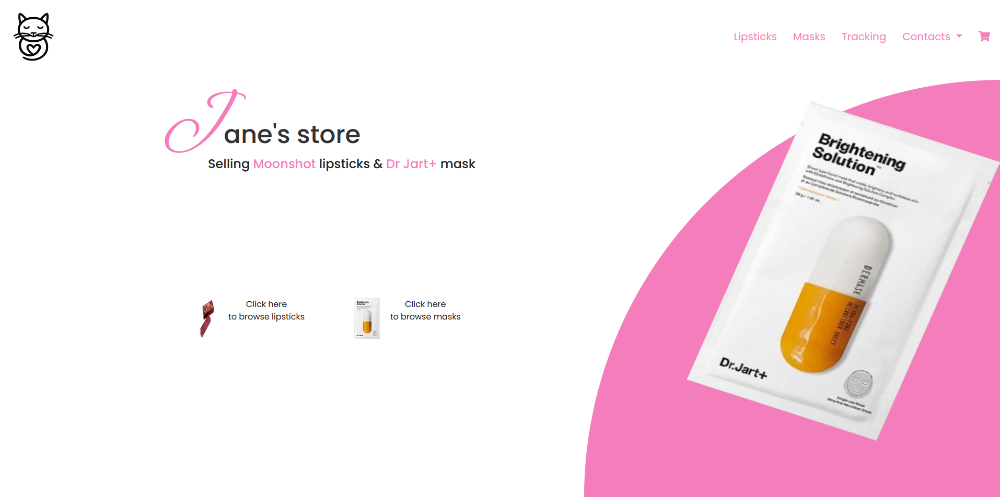
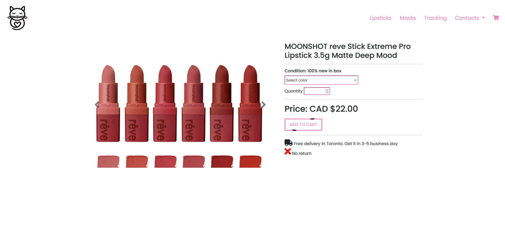
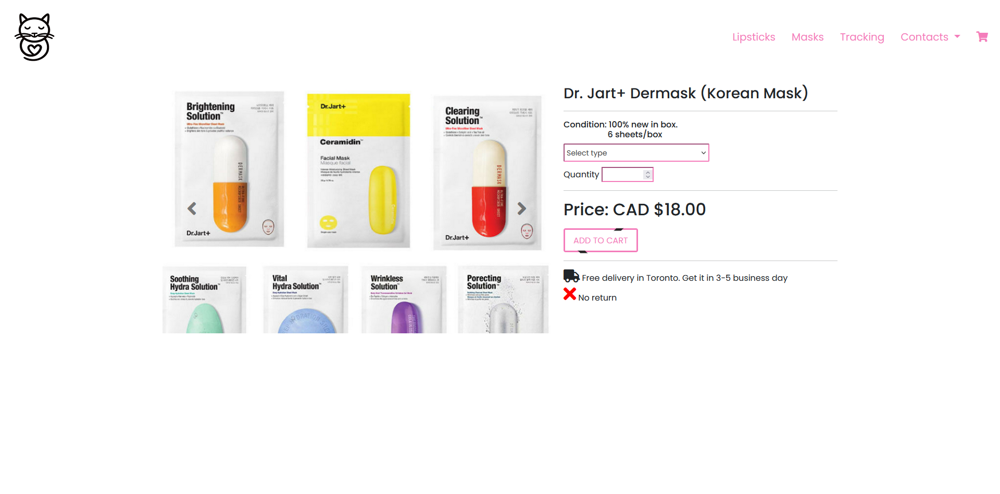
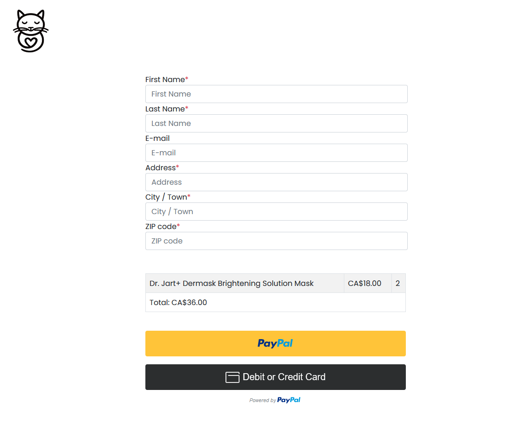
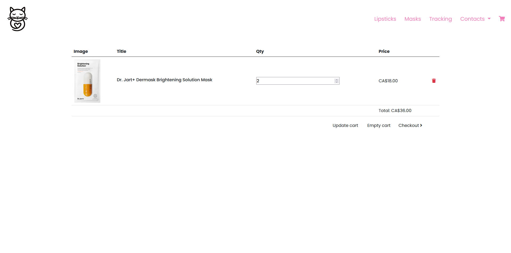
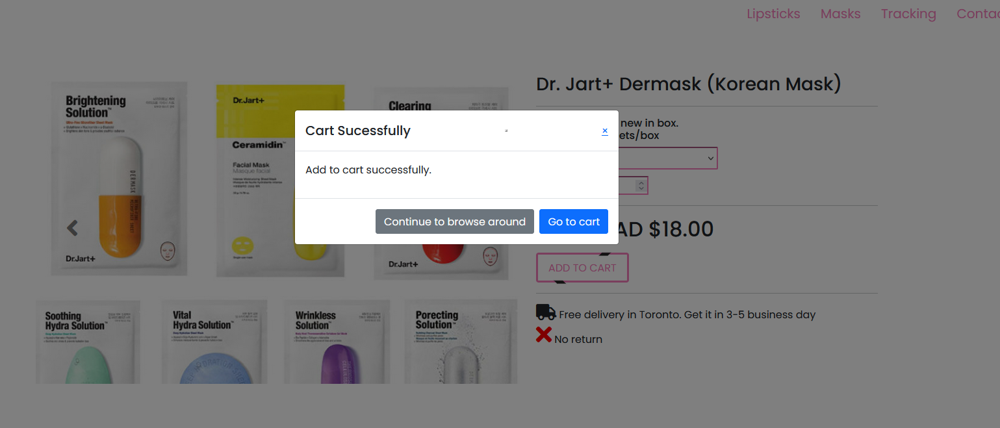
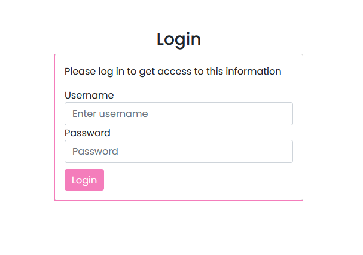
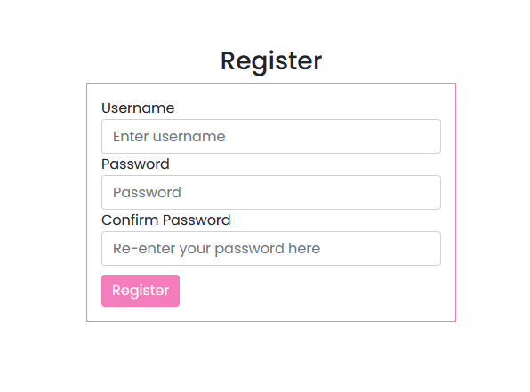
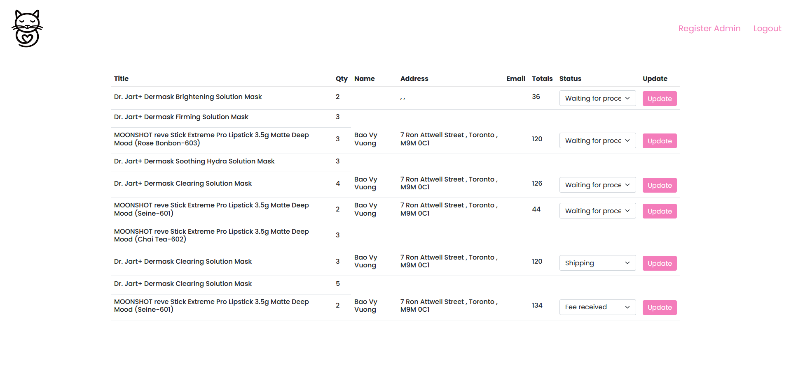

# Jane Store - A Small E-Commercial 

# Languages

    1. Front-end: EJS (Server Side Rendering)
    2. Back-end: ExpressJS
    3. Database: MongoDB 
    4. Styles: Boostrap
  
# Usage:

    1. Add and save user cart via token (do not need to login to place order)
    2. Checkout and pay via paypal
    3. Tracking orders
    4. Admin dashboard to upload status of order for tracking
    
# Showcase:

## Landing Page

## Lipstick Page

## Masks Page

## Checkout Page

## Cart

## Add To Cart

## Login && Register Admin

## Admin Page

